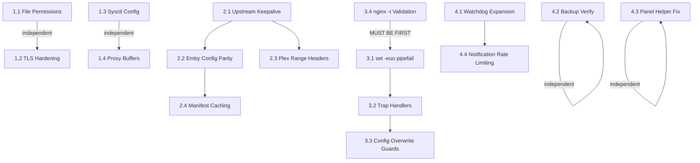

# System Audit Hardening

Full implementation plan covering all 4 phases identified in the 2026-02-11 system audit. Addresses security vulnerabilities, streaming performance bottlenecks, code quality gaps, and infrastructure monitoring holes.

## Enhancement Summary

**Deepened on:** 2026-02-11
**Research agents used:** security-sentinel, performance-oracle, architecture-strategist, code-simplicity-reviewer, deployment-verification-agent, pattern-recognition-specialist, best-practices-researcher (7 agents + 3 web searches)

### Critical Corrections to Original Plan

1. **Reorder Phase 3:** Execute 3.4 (`_reload_nginx`) BEFORE 3.1 (`set -euo pipefail`) -- it is a prerequisite, not independent
2. **Relocate `_reload_nginx()`:** From `panel_helpers.sh` to new `lib/nginx-utils.sh` -- panel_helpers is NOT sourced by media server scripts
3. **Reduce keepalive from 256 to 32:** 256 per-worker x 20 workers = 5,120 idle connections per backend; Plex connection pool exhaustion risk
4. **Fix sysctl dual-writer conflict:** `optimize-streaming.sh` and `bootstrap/lib/tuning.sh` both write `/etc/sysctl.d/99-streaming.conf` with conflicting values
5. **Expand Phase 1.1 permissions list:** 6 additional credential files missing (notifiarr, mdblist-sync, rclone, Decypharr, swizdb)
6. **Hard requirement: Remove GitHub download from `_load_panel_helper()`** -- not optional; root shell code execution vector. Use hybrid local/cache approach (no GitHub fallback)
7. **Add security headers via snippet include, NOT `ssl-params.conf`:** nginx `add_header` inheritance is destructive; per-vhost CSP causes all parent headers to be silently dropped
8. **Reduce `nf_conntrack_max` from 1M to 262K:** 300MB kernel memory wasted; 262K already provides 17,000x expected load headroom
9. **Fix HLS/DASH manifest cache:** 10m blanket cache breaks live TV/transcode playback; use tiered 5m/2s approach

### New Issues Discovered

- **API keys visible in `ps aux`** -- curl passes tokens as command-line args (zurg, watchdog, backup)
- **Predictable `/tmp` paths** -- symlink attack vector in 6+ scripts
- **sed injection risk** -- unsanitized user input in sed patterns across 4+ scripts
- **Missing `umask 077`** -- race window between file creation and `chmod 600`
- **Missing `worker_rlimit_nofile`** -- workers hit fd limits before connection limits
- **Missing `proxy_busy_buffers_size` increase** -- 64k bottleneck with 4MB buffer pool
- **Notification system duplication** -- ~200 lines copy-pasted between backup and watchdog
- **nginx `add_header` inheritance is destructive** -- global headers in `ssl-params.conf` silently lost when vhosts use per-vhost `add_header`; need snippet include approach

---

## Overview

**Current state:** 56 bash installer scripts managing a Swizzin media server with Plex, Emby, Jellyfin, Sonarr (x3), Radarr (x2), Zurg, and Docker containers. The audit found 17 security issues, 11 code quality gaps, 7 performance bottlenecks, and 5 infrastructure weaknesses.

**Target state:** Hardened scripts with proper error handling, secure credential management, optimized streaming for 20+ concurrent streams, and full service monitoring.

## Technical Approach

### Architecture

Changes span 4 layers of the stack, each independent enough to implement and test separately:

1. **System config files** (sysctl, nginx.conf, ssl-params.conf) -- direct edits on the live server
2. **Nginx vhost configs** (Plex, Emby, Jellyfin) -- written by installer scripts, also live on server
3. **Bash installer scripts** (48 files in repo) -- code changes committed to git
4. **Infrastructure scripts** (watchdog, backup, panel_helpers) -- code changes committed to git

### Risk Assessment

| Phase | Risk Level | Rollback | Impact if Wrong |
|-------|-----------|----------|-----------------|
| Phase 1: Quick Wins | LOW | `chmod` reversible, configs backed up | Minimal |
| Phase 2: Streaming | MEDIUM | nginx backups, `nginx -t` before reload | Service disruption if nginx breaks |
| Phase 3: Code Quality | HIGH | Git revert, but must test each script | Silent breakage in untested scripts |
| Phase 4: Infrastructure | LOW | New files only, existing systems untouched | Worst case: watchdog doesn't work |

---

## Implementation Phases

### Phase 1: Quick Wins

**Scope:** Server-side config changes. No script code changes.

#### 1.1 File Permission Hardening

**Files to fix on the live server:**

```bash
# Zurg config - contains Real-Debrid API tokens
chmod 600 /home/raflix/.config/zurg/config.yml

# Backup passphrase - BorgBackup encryption key
chmod 600 /root/.swizzin-backup-passphrase

# Backup key export - delete after display
rm -f /root/swizzin-backup-key-export.txt

# SSH backup key
chmod 600 /root/.ssh/id_backup

# Backup config - contains Pushover/Notifiarr/Discord tokens
chmod 640 /etc/swizzin-backup.conf
```

**Script changes to enforce on future installs:**

- [x] `zurg.sh`: Add `chmod 600` after writing config.yml, rclone.conf, Decypharr config; fix YAML injection; hide GitHub token from ps aux
- [x] `notifiarr.sh`: Add `chmod 600` after writing notifiarr.conf
- [x] `mdblist-sync.sh`: Add `chmod 600` after copying config
- [x] `watchdog/watchdog.sh`: Hide Pushover token and Notifiarr API key from ps aux via `--config <(printf ...)`
- [x] `backup/swizzin-backup.sh`: Hide Notifiarr API key from ps aux via `--config <(printf ...)`
- [ ] `backup/swizzin-backup-install.sh`: Add `chmod 600` for passphrase file, auto-delete key export after display, `chmod 640` for config
- [ ] `bootstrap/lib/hardening.sh`: Add `chmod 600` for SSH keys in the bootstrap flow

### Research Insights (Phase 1.1)

**CRITICAL -- 6 additional credential files missing from permissions list:**

| File | Script | Contains | Fix |
|------|--------|----------|-----|
| `/opt/swizzin-extras/notifiarr/notifiarr.conf` | `notifiarr.sh:138` | `DN_API_KEY` | `chmod 600` after `cat >` |
| `/opt/swizzin-extras/mdblist-sync.conf` | `mdblist-sync.sh:87` | Sonarr/Radarr/MDBList API keys | `chmod 600` after `cp` |
| `/home/$user/.config/rclone/rclone.conf` | `zurg.sh:811-819` | WebDAV credentials | `chmod 600` after write |
| `/home/$user/.config/Decypharr/config.json` | `zurg.sh:287` | Real-Debrid API key | `chmod 600` after `jq` write |
| swizdb backing store | `zurg.sh:1417` | RD API token via `swizdb set` | Verify backing store is `600` |
| Watchdog service configs | `emby-watchdog.sh:150` | Currently no secrets but prophylactic | `chmod 600` on `$CONFIG_DIR/*.conf` |

**Race condition mitigation:** Use `umask 077` before credential file creation OR `install -m 600`:
```bash
# Instead of:
cat > "$config_file" <<EOF ...  # World-readable until chmod
chmod 600 "$config_file"

# Use:
install -m 600 /dev/null "$config_file"
cat > "$config_file" <<EOF ...  # Already restricted
```

**API keys in process listings (NEW -- not in original plan):**
Scripts pass secrets as curl command-line arguments, visible via `ps aux`:
- `zurg.sh:173,588,638,1165,1206` -- `curl -sL -H "Authorization: token $github_token"`
- `watchdog/watchdog.sh:207-213` -- Pushover tokens in `--form-string`
- `backup/swizzin-backup.sh:334` -- Notifiarr API key in `-H "x-api-key:"`

**Fix:** Use process substitution to hide credentials:
```bash
# Instead of:
curl -sL -H "Authorization: token $github_token" "$url"

# Use:
curl -sL --config <(printf 'header = "Authorization: token %s"\n' "$github_token") "$url"
```

---

#### 1.2 TLS Hardening

**Edit `/etc/nginx/nginx.conf`:**

```nginx
# BEFORE:
ssl_protocols TLSv1 TLSv1.1 TLSv1.2 TLSv1.3;

# AFTER:
ssl_protocols TLSv1.2 TLSv1.3;
```

**Edit `/etc/nginx/snippets/ssl-params.conf`:**

```nginx
# Uncomment HSTS:
add_header Strict-Transport-Security "max-age=31536000; includeSubDomains; preload" always;
```

**Edit `/etc/nginx/nginx.conf`:**

```nginx
# Uncomment:
server_tokens off;
```

**Validation:** `nginx -t && systemctl reload nginx`

### Research Insights (Phase 1.2)

**CRITICAL -- nginx `add_header` inheritance is DESTRUCTIVE:**

When ANY `server` or `location` block uses `add_header`, ALL parent-level (`http`-level) `add_header` directives are **completely lost** for that block. Since all 9 subdomain scripts already use per-vhost `add_header Content-Security-Policy "frame-ancestors ..."`, putting security headers in `ssl-params.conf` would be SILENTLY DROPPED for every vhost with CSP.

**Solution: Create a dedicated snippet and `include` it in each vhost:**

1. **Create `/etc/nginx/snippets/security-headers.conf`:**
```nginx
add_header X-Content-Type-Options "nosniff" always;
add_header Referrer-Policy "strict-origin-when-cross-origin" always;
add_header Permissions-Policy "camera=(), microphone=(), geolocation=()" always;
```

2. **Update all 9+ subdomain scripts** to include this snippet in their vhost generation:
```nginx
server {
    # ...
    include snippets/security-headers.conf;
    add_header Content-Security-Policy "frame-ancestors 'self' https://$organizr_domain";
    # ...
}
```

3. **Also add to `ssl-params.conf`** as a fallback for vhosts that DON'T define their own `add_header` (these inherit normally).

**Files to update:** `plex.sh`, `emby.sh`, `jellyfin.sh`, `seerr.sh`, `lingarr.sh`, `mdblistarr.sh`, `libretranslate.sh`, `plex-tunnel.sh`, `template-subdomain.sh`, `organizr.sh`, `panel.sh`

> **Note:** Do NOT add `X-Frame-Options`. CSP `frame-ancestors` already handles framing per-vhost with Organizr domain support. Modern browsers prioritize CSP `frame-ancestors` and ignore `X-Frame-Options` when both are present. Also, `X-Frame-Options` cannot express "allow self + Organizr domain" (only supports single ALLOW-FROM).

**OCSP Stapling -- add to `/etc/nginx/snippets/ssl-params.conf`:**

```nginx
ssl_stapling on;
ssl_stapling_verify on;
resolver 1.1.1.1 8.8.8.8 valid=300s;
resolver_timeout 5s;
```

**Cipher suite specification -- add to `/etc/nginx/snippets/ssl-params.conf`:**

```nginx
ssl_prefer_server_ciphers on;
ssl_ciphers 'ECDHE-ECDSA-AES128-GCM-SHA256:ECDHE-RSA-AES128-GCM-SHA256:ECDHE-ECDSA-AES256-GCM-SHA384:ECDHE-RSA-AES256-GCM-SHA384';
```

**Verification after applying:**
```bash
# Check that ALL headers are present on a vhost with CSP:
curl -I https://plex.example.com | grep -E "X-Content-Type|Referrer-Policy|Permissions-Policy|Content-Security-Policy"
# Should show all 4 headers
```

---

#### 1.3 Sysctl Streaming Configuration

Update `optimize-streaming.sh` to write a complete `/etc/sysctl.d/99-streaming.conf` instead of just `ip_local_port_range`. The bootstrap `tuning.sh` already has most of these parameters -- this change brings the standalone optimizer to parity.

- [x] `optimize-streaming.sh`: Replace the sysctl configuration section to write full config to `99-streaming-optimizer.conf`
- [x] Ensure no conflict with `bootstrap/lib/tuning.sh` -- uses separate sysctl file (alphabetical precedence)

**Parameters to add to `optimize-streaming.sh`:**

```sysctl
net.ipv4.tcp_tw_reuse=1
net.ipv4.tcp_fin_timeout=30
net.ipv4.tcp_keepalive_time=600
net.ipv4.tcp_keepalive_probes=5
net.ipv4.tcp_keepalive_intvl=15
net.netfilter.nf_conntrack_max=262144
net.netfilter.nf_conntrack_tcp_timeout_established=600
net.netfilter.nf_conntrack_tcp_timeout_time_wait=120
net.netfilter.nf_conntrack_tcp_timeout_fin_wait=120
net.ipv4.udp_mem=94500000 915000000 927000000
net.ipv4.udp_rmem_min=8192
net.ipv4.udp_wmem_min=8192
net.core.rps_sock_flow_entries=512000
net.core.optmem_max=67108864
```

### Research Insights (Phase 1.3)

**CRITICAL -- Dual sysctl writer conflict:**

Both `optimize-streaming.sh` and `bootstrap/lib/tuning.sh` write to the same file `/etc/sysctl.d/99-streaming.conf` with conflicting values:

| Parameter | `tuning.sh` (bootstrap) | Original Plan | Corrected |
|-----------|------------------------|---------------|-----------|
| `nf_conntrack_max` | 262,144 | 1,000,000 | **262,144** (sufficient -- 17,000x expected load) |
| `nf_conntrack_tcp_timeout_established` | 86,400 (24h) | 600 (10min) | **600** (plan correct -- bootstrap value is dangerously high) |
| `nf_conntrack_tcp_timeout_time_wait` | 30 | 120 | **30** (bootstrap value is better) |
| `tcp_fin_timeout` | 15 | 30 | **15** (bootstrap value is better for streaming) |
| `tcp_keepalive_intvl` | 60 | 15 | **15** (plan value is better for dead session detection) |

**Resolution strategy:** Have `optimize-streaming.sh` write to a SEPARATE file `/etc/sysctl.d/99-streaming-optimizer.conf` so both coexist. Sysctl files are loaded alphabetically; the optimizer file takes precedence on overlapping keys. The optimizer should ONLY write parameters where it intentionally differs from bootstrap.

**Additional files requiring updates for the rename:**
- [x] `bootstrap/lib/restore.sh:127` -- add `rm -f /etc/sysctl.d/99-streaming-optimizer.conf` alongside existing cleanup
- [x] `bootstrap/bootstrap.sh:245` -- update status check to also detect `99-streaming-optimizer.conf`
- [x] `optimize-streaming.sh:341` -- update its own status check to use new filename
- [x] Add migration logic in optimizer: if old entries exist in `99-streaming.conf`, don't duplicate

**Current behavior note:** The optimizer currently APPENDS (`>>`) only `ip_local_port_range`. The plan changes this to a full file write (`cat >`), which is a semantic change requiring the separate filename.

**MUST preserve these bootstrap-only parameters** (not in plan, would be lost if optimizer overwrites):
- `net.core.default_qdisc = fq` (required for BBR)
- `net.ipv4.tcp_congestion_control = bbr`
- `net.ipv4.tcp_fastopen = 3`
- `net.ipv4.tcp_slow_start_after_idle = 0`
- `vm.swappiness = 10`, `vm.vfs_cache_pressure = 50`, `vm.dirty_ratio = 15`
- `fs.file-max = 2097152`, `fs.inotify.max_user_watches = 524288`
- All security parameters (rp_filter, log_martians, etc.)

**`nf_conntrack_max` sizing math:** Each entry = ~300 bytes. At 262K = ~75MB kernel memory. At 1M = ~300MB. For 30 streams with ~22 conntrack entries each = 660 active entries. 262K provides massive headroom without wasting 225MB of kernel memory.

**Confirmed via web search:** `tcp_tw_reuse=1` is still valid and recommended for kernel 6.x. The deprecated `tcp_tw_recycle` was removed in kernel 4.12 and is not a concern.

---

#### 1.4 Proxy Buffer Increase

- [ ] `nginx-streaming.sh`: Change `OPTIMIZED_PROXY_BUFFERS` from `"64 8k"` to `"256 16k"` (4MB per connection, needed for 4K HDR @ 50Mbps with jitter)

### Research Insights (Phase 1.4)

**Important context:** Plex and Jellyfin vhosts already set `proxy_buffering off`, so the buffer increase primarily benefits:
- Emby (which currently has buffering ON)
- Non-streaming requests (metadata, API calls) to all servers

The real streaming performance gain for Plex/Jellyfin comes from keepalive pooling (Phase 2.1), not buffer increases.

**MUST also increase `proxy_busy_buffers_size`** in `nginx-streaming.sh:133`:
```nginx
# BEFORE:
proxy_busy_buffers_size 64k;

# AFTER:
proxy_busy_buffers_size 512k;
```
Without this, nginx can only send 64k to the client while reading from the backend -- a bottleneck with the 4MB buffer pool.

---

**Acceptance criteria:**
- [ ] All credential files have restrictive permissions (original 5 + 6 new)
- [ ] TLS 1.0/1.1 removed, HSTS enabled, server_tokens off
- [ ] Security headers snippet created and included in all vhosts with per-vhost `add_header`
- [ ] `curl -I` on any subdomain shows X-Content-Type-Options, Referrer-Policy, Permissions-Policy AND CSP
- [ ] `sysctl -p /etc/sysctl.d/99-streaming-optimizer.conf` loads without errors
- [ ] `nginx -t` passes after all nginx changes
- [ ] No API keys visible in `ps aux` output during curl operations

---

### Phase 2: Streaming Performance

**Scope:** Nginx configuration changes in both installer scripts and live server configs.

#### 2.1 Nginx Upstream Keepalive Connection Pooling

Add upstream blocks with keepalive for all 3 media servers. This affects both the installer scripts (for new installs) and the live nginx configs (for immediate effect).

**Pattern to apply to `plex.sh`, `emby.sh`, `jellyfin.sh` subdomain nginx config generation:**

```nginx
upstream <app>_backend {
    server 127.0.0.1:<port>;
    keepalive 32;
}

server {
    # ... existing config ...
    location / {
        proxy_pass http://<app>_backend;
        proxy_http_version 1.1;
        proxy_set_header Connection "";
        # ... rest of existing proxy headers ...
    }
}
```

**Files to modify:**
- [ ] `plex.sh`: `_install_subdomain()` and `_nginx_plex()` -- add upstream block, change `proxy_pass` to use upstream name, add `proxy_http_version 1.1` and `proxy_set_header Connection ""`
- [ ] `emby.sh`: Same pattern for both subdomain and subfolder configs
- [ ] `jellyfin.sh`: Same pattern
- [ ] `mdblistarr.sh`: Has 4 nginx reload calls -- needs upstream pattern too
- [ ] `plex-tunnel-vps.sh`: Also needs upstream pattern

**Edge case:** The upstream block must be outside the `server {}` block. Each media server's upstream name must be unique. Upstream blocks should be placed in a separate `/etc/nginx/conf.d/upstream-<app>.conf` file (preferred -- prevents duplication if both subfolder and subdomain are configured).

### Research Insights (Phase 2.1)

**Keepalive reduced from 256 to 32:**

The `keepalive` directive controls idle connections **per worker process**. With `worker_processes auto` on 20 cores:
- `keepalive 256` = 20 x 256 = 5,120 idle connections per backend (15,360 total)
- `keepalive 32` = 20 x 32 = 640 idle connections per backend (1,920 total)

At 30 concurrent streams, peak backend connections rarely exceed 50-80. `keepalive 32` is generous.

**Why 256 is harmful:** Plex has a limited internal connection pool. Flooding it with 5,000+ idle connections from nginx can cause connection rejection or file descriptor exhaustion.

**Corrected nginx directives for reverse proxy streaming:**

> **IMPORTANT (verified in second deepen round):** Most file-serving directives do NOT apply to a reverse proxy setup. `sendfile`, `tcp_nopush`, `aio threads`, `directio`, and `output_buffers` are for direct file serving, not proxied traffic. The proxied data flows through `proxy_buffers`, not the file I/O path.

Directives that DO help for reverse proxy:

```nginx
# tcp_nodelay is already nginx default for keepalive/SSL connections
# Explicitly setting it is redundant but harmless
tcp_nodelay on;
```

**Directives to SKIP (not applicable to reverse proxy):**
- `sendfile on` -- optimizes file-to-socket, not proxy-to-socket
- `tcp_nopush on` -- requires sendfile; does nothing without it
- `aio threads` -- offloads file I/O, not proxy buffer I/O
- `directio 512` -- bypasses page cache for files; proxy doesn't serve files
- `output_buffers 4 64k` -- for disk reads, not proxy responses

**Missing `worker_rlimit_nofile` -- add to nginx.conf changes:**

```nginx
worker_rlimit_nofile 65535;  # Top-level, outside events block
```

Without this, workers inherit system default fd limit (often 1024), hitting limits before connection limits. Each proxied connection needs 2 fds (client + upstream). Formula: `worker_rlimit_nofile >= 2 x worker_connections`.

**Upstream conf.d cleanup:** Removal paths for each media server script must also remove `/etc/nginx/conf.d/upstream-<app>.conf`. Add to `_remove_*` functions.

---

#### 2.2 Emby Nginx Config Parity

The Emby nginx config is missing features that Plex and Jellyfin have. Bring Emby to parity.

- [ ] `emby.sh`: Add to the subdomain/subfolder nginx config:
  - `proxy_buffering off;` -- required for live streaming
  - `proxy_http_version 1.1;` -- **CRITICAL: required for keepalive to work**
  - `proxy_set_header Connection "";` -- **CRITICAL: required for keepalive to work**
  - Streaming timeouts: `proxy_read_timeout 3600s; proxy_send_timeout 3600s;` (currently inherits 240s from proxy.conf)
  - `client_max_body_size 0;` -- unlimited upload (currently 40m from proxy.conf)
  - WebSocket support:
    ```nginx
    location /embywebsocket {
        proxy_pass http://emby_backend;
        proxy_http_version 1.1;
        proxy_set_header Upgrade $http_upgrade;
        proxy_set_header Connection "upgrade";
    }
    ```

### Research Insights (Phase 2.2)

**Without `proxy_http_version 1.1` and `Connection ""` in Emby's `location /` block, the keepalive upstream pool is completely unused.** nginx defaults to HTTP/1.0 for upstream connections, which does not support persistent connections. This must be explicitly called out as a required change for Emby's existing `location /` block, not just the new WebSocket location.

---

#### 2.3 Plex Range Header Fix

- [ ] `plex.sh`: Add Range request headers to the main `location /` block (currently only in `/library/streams/`):
  ```nginx
  proxy_set_header Range $http_range;
  proxy_set_header If-Range $http_if_range;
  ```

#### 2.4 HLS/DASH Manifest Caching (Optional)

Lower priority. Consider adding a proxy cache zone for `.m3u8` and `.mpd` manifest files. This is beneficial but adds complexity.

### Research Insights (Phase 2.4)

**CRITICAL -- Original 10m cache breaks live TV and transcoding.**

HLS manifests update every 2-6 seconds during live/transcode streams. A 10-minute cache serves stale manifests pointing to nonexistent segments, causing playback stalls.

**Corrected tiered approach:**

```nginx
proxy_cache_path /var/cache/nginx/manifests levels=1:2
    keys_zone=manifests:10m max_size=100m inactive=2m
    use_temp_path=off;

# VOD manifests (stable after generation)
location ~* /library/parts/.*\.(m3u8|mpd)$ {
    proxy_cache manifests;
    proxy_cache_valid 200 5m;
    proxy_cache_use_stale error timeout updating;
    proxy_pass http://<app>_backend;
}

# Live/transcode manifests (must stay fresh)
location ~* /video/:/transcode/.*\.(m3u8|mpd)$ {
    proxy_cache manifests;
    proxy_cache_valid 200 2s;
    proxy_cache_lock on;
    proxy_pass http://<app>_backend;
}
```

Key additions:
- `use_temp_path=off` -- avoids copy from temp to cache directory
- `proxy_cache_use_stale` -- serves stale during backend errors (graceful degradation)
- `proxy_cache_lock on` -- prevents cache stampede (multiple clients requesting same manifest)
- `inactive=2m` -- evicts entries not accessed for 2 minutes
- 2s cache for transcode still reduces manifest requests by 80% with 5 concurrent viewers

---

**Acceptance criteria:**
- [ ] `nginx -t` passes after all changes
- [ ] Connection pooling verified via `ss -tnp | grep :32400` showing ESTABLISHED connections in keepalive
- [ ] Emby WebSocket endpoint accessible (test with browser dev tools)
- [ ] Plex seeking/resume works from main location (Range headers)
- [ ] Emby uses HTTP/1.1 for upstream connections (verify with `nginx -T | grep proxy_http_version`)

---

### Phase 3: Code Quality

**Scope:** Bash script modifications across 48+ files. This is the highest-risk phase.

> **IMPORTANT -- Execution order change:** Phase 3.4 (`_reload_nginx` helper) MUST be completed BEFORE Phase 3.1 (`set -euo pipefail`). The nginx validation helper is a prerequisite for safe rollout of strict mode, not independent of it.

#### 3.4 Nginx Validation Before Reload (DO THIS FIRST)

Replace every bare `systemctl reload nginx` with validated reload. There are **65 instances** across 22 files (42 in install paths, 23 in removal paths).

**Two categories:**

1. **Install/configure paths** (must fail if nginx config is bad):
   ```bash
   _reload_nginx || { echo_error "Nginx config validation failed"; exit 1; }
   ```

2. **Removal paths** (`|| true` already present, keep as-is but add `-t`):
   ```bash
   _reload_nginx 2>/dev/null || true
   ```

**Implementation approach:** Create a helper function in a NEW shared library:

```bash
# lib/nginx-utils.sh (NEW FILE)
_reload_nginx() {
    if [[ -f /install/.nginx.lock ]]; then
        local test_output
        if test_output=$(nginx -t 2>&1); then
            systemctl reload nginx
        else
            echo_error "Nginx configuration test failed:"
            echo_error "$test_output"
            return 1
        fi
    fi
}
```

### Research Insights (Phase 3.4)

**CRITICAL architectural correction:** `_reload_nginx()` must NOT go in `panel_helpers.sh`.

Panel helpers is NOT sourced by media server scripts (`plex.sh`, `emby.sh`, `jellyfin.sh`). These are the scripts with the most nginx reload calls (5, 4, and 3 respectively). Placing `_reload_nginx()` there would leave the highest-traffic scripts unprotected.

**Correct location:** New file `lib/nginx-utils.sh` at the repo root (`/opt/swizzin-scripts/lib/nginx-utils.sh`).

> **Verified in second deepen round:** All 24 scripts that reload nginx are either in the root directory (21 scripts) or `templates/` (5 scripts). No backup/, watchdog/, or bootstrap/ scripts reload nginx.

**Sourcing pattern for root-level scripts (21 scripts):**
```bash
SCRIPT_DIR="$(cd "$(dirname "${BASH_SOURCE[0]}")" && pwd)"
# shellcheck source=lib/nginx-utils.sh
. "${SCRIPT_DIR}/lib/nginx-utils.sh" 2>/dev/null || true
```

**Sourcing pattern for templates/ scripts (5 scripts):**
```bash
SCRIPT_DIR="$(cd "$(dirname "${BASH_SOURCE[0]}")" && pwd)"
# shellcheck source=../lib/nginx-utils.sh
. "${SCRIPT_DIR}/../lib/nginx-utils.sh" 2>/dev/null || true
```

**Note:** Most of the 21 root-level scripts don't currently define `SCRIPT_DIR` (they use Swizzin globals instead). Adding `SCRIPT_DIR` is required for these scripts -- same change needed for the panel helper fix (Phase 4.3).

**The `_reload_nginx()` helper should capture and log stderr** from `nginx -t` to aid debugging. Updated implementation above includes this.

- [ ] Create `lib/nginx-utils.sh` with `_reload_nginx()` function
- [ ] Source it from all scripts that call `systemctl reload nginx`
- [ ] Replace all 42 install-path `systemctl reload nginx` calls with `_reload_nginx`
- [ ] Replace all 23 removal-path calls with `_reload_nginx 2>/dev/null || true`
- [ ] Update all 5 templates

---

#### 3.1 Add `set -euo pipefail` to All Scripts

**CRITICAL EDGE CASES identified by SpecFlow analysis and pattern recognition:**

1. **`set -u` breaks `$1`/`$2` access**: 18 files use `case "$1" in` and 91 occurrences of `"$2"` across 37 files. If called with no args, `$1` is unset and `set -u` will abort.
   - **Fix:** Change all `$1` to `${1:-}` and `$2` to `${2:-}` in argument parsing sections.

2. **359 `|| true` patterns across 41 files**: Breakdown from pattern analysis:
   - **~80 `systemctl stop/disable || true`** in removal paths -- **KEEP** (service may already be stopped)
   - **~23 `systemctl reload nginx || true`** in removal paths -- **KEEP** (nginx may not be installed)
   - **~45 `swizdb clear || true`** in removal paths -- **KEEP** (key may not exist)
   - **~60 `curl/grep/sed` fallbacks** -- **KEEP** (non-fatal failures)
   - **~6 `(( count++ )) || true`** arithmetic guards -- **KEEP** (essential under `set -e`)
   - **~15 install-path commands** -- **REVIEW individually** (may mask real errors)

3. **Commands that legitimately return non-zero**: `grep -q`, `diff`, `systemctl is-active` return non-zero for "not found" / "not active" which is normal flow.
   - **Fix:** These must use `if command; then` or `command || true` patterns.

4. **Arithmetic expressions**: `(( count++ ))` returns exit code 1 when `count` is 0 (0 is falsy in bash). The watchdog handles this with `|| true`. **Document this pattern in coding standards.**

5. **SIGPIPE**: When nginx config test output is piped, SIGPIPE (signal 13) can kill the script. Add `trap '' PIPE` to the trap template (see 3.2).

**Implementation approach -- do templates first, then scripts in batches with verification gates:**

- [ ] **Step 1: Update all 5 templates** (`template-binary.sh`, `template-python.sh`, `template-docker.sh`, `template-subdomain.sh`, `template-multiinstance.sh`):
  - Add `set -euo pipefail` after the shebang
  - Change `$1`/`$2` to `${1:-}`/`${2:-}` in `case` statements
  - Test each template's CLI flows: `--install`, `--remove`, `--update`, no args
  - Also fix `[ ]` to `[[ ]]` inconsistency in `template-subdomain.sh` (18 occurrences)

- [ ] **Step 2: Update installer scripts** (group by complexity):

  **Simple installers** (single binary, straightforward):
  - `cleanuparr.sh`, `decypharr.sh`, `notifiarr.sh`, `huntarr.sh`, `byparr.sh`, `flaresolverr.sh`, `bazarr.sh`

  **Medium complexity** (multi-instance or Docker):
  - `sonarr.sh`, `radarr.sh`, `lingarr.sh`, `libretranslate.sh`, `subgen.sh`, `seerr.sh`

  **Complex** (subdomain + extended installer):
  - `plex.sh`, `emby.sh`, `jellyfin.sh`, `organizr.sh`, `panel.sh`, `plex-tunnel.sh`, `plex-tunnel-vps.sh`

  **Utility scripts:**
  - `dns-fix.sh`, `panel_helpers.sh`, `arr-symlink-import.sh`, `mdblistarr.sh`

  > **Verification gate:** After each batch, test `--install`, `--remove`, and no-args for every script in the batch. Git commit after each batch for granular rollback.

- [ ] **Step 3: Update optimization scripts** (`nginx-streaming.sh`, `optimize-streaming.sh`, `optimize-docker.sh`):
  - Upgrade from `set -e` to `set -euo pipefail`

#### 3.2 Add Trap Handlers

Model after the backup script's trap pattern (`backup/swizzin-backup.sh` lines 519-556).

**Standard trap template for installer scripts:**

```bash
# --- Cleanup state ---
_cleanup_needed=false
_nginx_config_written=""
_nginx_symlink_created=""
_systemd_unit_written=""
_lock_file_created=""

cleanup() {
    local exit_code=$?
    if [[ "$_cleanup_needed" == "true" && $exit_code -ne 0 ]]; then
        echo_error "Installation failed. Cleaning up..."
        [[ -n "$_nginx_config_written" ]] && rm -f "$_nginx_config_written"
        [[ -n "$_nginx_symlink_created" ]] && rm -f "$_nginx_symlink_created"
        [[ -n "$_systemd_unit_written" ]] && {
            systemctl stop "${_systemd_unit_written}" 2>/dev/null || true
            systemctl disable "${_systemd_unit_written}" 2>/dev/null || true
            rm -f "/etc/systemd/system/${_systemd_unit_written}"
        }
        [[ -n "$_lock_file_created" ]] && rm -f "$_lock_file_created"
        _reload_nginx 2>/dev/null || true
    fi
}
trap cleanup EXIT
trap 'exit 130' INT
trap 'exit 143' TERM
trap '' PIPE
```

### Research Insights (Phase 3.2)

**`_nginx_symlink_created` added** for subdomain scripts that create both `sites-available` and `sites-enabled` symlinks. Original template only tracked `_nginx_config_written`.

**`trap '' PIPE` added** to ignore SIGPIPE which can occur when piping nginx -t output.

**Coding standard needed:** "No sourced library may set traps" -- a trap set in a sourced file would overwrite the script's own trap. The trap template belongs in each script's top-level code, not in any shared library.

**Do NOT replicate the `set +e` / `set -e` toggle pattern** from the backup script (lines 713/755). That pattern captures `PIPESTATUS` after borg create, which has complex exit status semantics. Installer scripts should use `if ! command; then handle_error; fi` instead.

**Implementation:**

- [ ] Add trap template to all 5 templates first
- [ ] Set `_cleanup_needed=true` at the start of the install flow
- [ ] Set `_nginx_config_written`, `_systemd_unit_written` etc. as each step completes
- [ ] Set `_cleanup_needed=false` at the very end (successful completion)
- [ ] Propagate to all installer scripts (same grouping as 3.1)

#### 3.3 Config Overwrite Guards

Prevent re-run from destroying user customizations.

- [ ] `radarr.sh`, `sonarr.sh`, `bazarr.sh`: Wrap config file generation in `if [[ ! -f "$config_file" ]]; then`
- [ ] All templates: Add the same guard pattern

**Pattern (from `mdblist-sync.sh:82-91`, already correct):**

```bash
if [[ ! -f "${config_dir}/config.xml" ]]; then
    echo_info "Creating default config..."
    cat > "${config_dir}/config.xml" <<-EOF
    ...
    EOF
else
    echo_info "Existing config found, preserving..."
fi
```

### Research Insights (Phase 3.3)

**Sed injection risk (NEW -- not in original plan):**

Multiple scripts inject user-controlled variables directly into `sed` patterns:

- `plex.sh:270-272` -- `_set_plex_pref()`: `sed -i "s|${key}=\"[^\"]*\"|${key}=\"${value}\"|"` -- `$value` with `|`, `&`, or `\` corrupts the substitution
- `mdblist-sync.sh:101` -- `_set_config()`: user `read -rp` input directly in sed
- `libretranslate.sh:463-474` -- URLs in sed (URLs contain sed-special characters)
- `panel_helpers.sh:79` -- `$classname` may contain regex metacharacters

**Fix:** Add `_sed_escape()` helper to shared utilities:
```bash
_sed_escape() {
    printf '%s\n' "$1" | sed 's/[&/\|]/\\&/g'
}
```
Or better: use `awk` or `python3` for config modifications involving user input.

**YAML injection in zurg config (`zurg.sh:714-760`):**
```yaml
# BEFORE (injection risk if token contains : or #):
token: ${RD_TOKEN}

# AFTER:
token: "${RD_TOKEN}"
```

**Predictable `/tmp` paths (NEW -- not in original plan):**

Symlink attack vector in 6+ scripts:
- `zurg.sh:581,640,685` -- `/tmp/zurg.zip`
- `notifiarr.sh:122` -- `/tmp/notifiarr.gz`
- `decypharr.sh:199` -- `/tmp/decypharr.tar.gz`
- `cleanuparr.sh:92` -- `/tmp/cleanuparr.zip`
- `flaresolverr.sh:121` -- `/tmp/flaresolverr.tar.gz`
- `seerr.sh:277` -- `/tmp/seerr.tar.gz`

**Fix:** Replace with `mktemp`:
```bash
local tmp_file
tmp_file=$(mktemp /tmp/zurg-XXXXXX.zip)
trap "rm -f '$tmp_file'" EXIT  # or add to cleanup function
```

---

**Acceptance criteria:**
- [ ] `_reload_nginx` helper exists and is sourced by all nginx-touching scripts (do FIRST)
- [ ] Every script can run with no args without crashing (`set -u` safe)
- [ ] Every script's `--remove` path still works (cleanup functions don't interfere)
- [ ] `nginx -t` is called before every reload
- [ ] Config files are not overwritten if they already exist
- [ ] No predictable `/tmp` file paths in any script
- [ ] No unsanitized user input in sed patterns

---

### Phase 4: Infrastructure

**Scope:** New scripts and modifications to existing infrastructure.

#### 4.1 Watchdog Expansion

The watchdog engine (`watchdog/watchdog.sh`) is fully generic. Adding Plex and Jellyfin requires new wrapper scripts following the `emby-watchdog.sh` pattern.

**New files:**
- [ ] `watchdog/plex-watchdog.sh` -- copy `emby-watchdog.sh`, set:
  - `SERVICE_NAME="plexmediaserver"`
  - `APP_NAME="Plex"`
  - `HEALTH_URL="http://127.0.0.1:32400/identity"`
  - `HEALTH_EXPECT="MediaContainer"` (Plex returns XML with MediaContainer element)
  - `_check_plex_installed()` checking `/install/.plex.lock`
- [ ] `watchdog/jellyfin-watchdog.sh` -- copy `emby-watchdog.sh`, set:
  - `SERVICE_NAME="jellyfin"`
  - `APP_NAME="Jellyfin"`
  - `HEALTH_URL="http://127.0.0.1:8096/health"`
  - `HEALTH_EXPECT="Healthy"`
  - `_check_jellyfin_installed()` checking `/install/.jellyfin.lock`
- [ ] `watchdog/configs/plex-watchdog.conf.example`
- [ ] `watchdog/configs/jellyfin-watchdog.conf.example`

**Watchdog state persistence fix:**
- [ ] `watchdog/watchdog.sh`: Change `STATE_DIR="/var/run/watchdog"` to `STATE_DIR="/var/lib/watchdog"` so state survives reboots

**HTTP health check improvement:**
- [ ] `watchdog/watchdog.sh`: Validate HTTP response code (200-399) in addition to body content check

### Research Insights (Phase 4.1)

**Port note:** Emby and Jellyfin installer scripts already handle port configuration (they don't conflict). The watchdog health URL should read the configured port from the app's config or use the port stored in swizdb, rather than hardcoding 8096.

**Naming conventions (from pattern analysis):**
- File names: `<service>-watchdog.sh`, `<service>-watchdog.conf.example`
- Functions: `_check_<service>_installed()`, `_install()`, `_remove()`, `_status()`, `_reset()`
- Logging: Use `echo_success` (not `echo_ok`) with `$1` (not `$*`), Blue `\033[0;34m` for INFO

**State directory migration:** The plan changes `STATE_DIR` from `/var/run/watchdog` to `/var/lib/watchdog`. Deployed systems need migration logic:
```bash
# In watchdog.sh, add after STATE_DIR definition:
if [[ -d "/var/run/watchdog" && ! -d "$STATE_DIR" ]]; then
    mkdir -p "$STATE_DIR"
    cp /var/run/watchdog/*.state "$STATE_DIR/" 2>/dev/null || true
fi
```

**State file security:** `watchdog.sh:109` does `source "$STATE_FILE"` -- executes arbitrary bash. Ensure `$STATE_DIR` is created with `chmod 750` and state files with `chmod 600`. The plan's new `/var/lib/watchdog` directory must have restrictive permissions.

**HTTP health check improvement:**
```bash
local http_code
http_code=$(curl -s -o /dev/null -w '%{http_code}' --max-time "$HEALTH_TIMEOUT" "$HEALTH_URL")
# Check 200-399 range
if [[ "$http_code" -ge 200 && "$http_code" -lt 400 ]]; then
    ...
fi
```

---

#### 4.2 Backup Restore Testing Automation

- [ ] `backup/swizzin-backup.sh`: Add `--verify` flag that runs `borg check --verify-data` on the latest archive
- [ ] Create weekly cron job template for `borg check`

#### 4.3 Panel Helper Supply Chain Fix

### Research Insights (Phase 4.3)

**This is the #1 highest-impact security change in the entire plan.** The current `_load_panel_helper()` pattern is a textbook supply chain attack:

1. 20+ scripts contain identical `_load_panel_helper()` that downloads from GitHub
2. Downloaded script is **sourced directly into the running root shell** (`. "$PANEL_HELPER_LOCAL"`)
3. If the GitHub account is compromised, arbitrary code executes as root on every script run

**HARD REQUIREMENT: Eliminate GitHub download as primary/fallback path.**

> **Implementation caveat (verified in second deepen round):** NONE of the 19 scripts with `_load_panel_helper()` currently define `SCRIPT_DIR`. Also, scripts can be downloaded and run standalone (not from the repo). A pure local-only approach would break standalone usage.

**Recommended hybrid approach -- prefer local repo, fallback to cache, remove GitHub download:**

- [ ] **Add `SCRIPT_DIR`** to all 19 scripts that use `_load_panel_helper()` (they currently lack it):
  ```bash
  SCRIPT_DIR="$(cd "$(dirname "${BASH_SOURCE[0]}")" && pwd)"
  ```
- [ ] **Replace `_load_panel_helper()` with this secure version:**
  ```bash
  PANEL_HELPER_CACHE="/opt/swizzin-extras/panel_helpers.sh"

  _load_panel_helper() {
      # Prefer local repo copy (eliminates supply chain risk)
      if [[ -f "${SCRIPT_DIR}/panel_helpers.sh" ]]; then
          . "${SCRIPT_DIR}/panel_helpers.sh"
          return
      fi

      # Fallback to cached copy (from previous repo-based run)
      if [[ -f "$PANEL_HELPER_CACHE" ]]; then
          . "$PANEL_HELPER_CACHE"
          return
      fi

      # NO GitHub download -- fail gracefully
      echo_info "panel_helpers.sh not found; skipping panel integration"
  }
  ```
- [ ] **Remove `PANEL_HELPER_URL`** variable entirely from all scripts
- [ ] **Remove ALL `curl` download logic** from every `_load_panel_helper()`

**Files requiring this change (19 scripts):**
16 production scripts (`bazarr.sh`, `byparr.sh`, `cleanuparr.sh`, `decypharr.sh`, `flaresolverr.sh`, `huntarr.sh`, `libretranslate.sh`, `lingarr.sh`, `mdblistarr.sh`, `notifiarr.sh`, `plex-tunnel.sh`, `radarr.sh`, `seerr.sh`, `sonarr.sh`, `subgen.sh`, `zurg.sh`) + 3 templates (`template-binary.sh`, `template-docker.sh`, `template-multiinstance.sh`).

This is a mechanical find-and-replace. The `PANEL_HELPER_LOCAL` and `PANEL_HELPER_URL` variables plus the download logic are identical across all 19 files.

---

#### 4.4 Notification Rate Limiting

Add rate limiting to prevent notification spam during cascading failures.

- [ ] `watchdog/watchdog.sh`: Add notification throttle -- check last notification timestamp before sending
- [ ] `backup/swizzin-backup.sh`: Same pattern

**Pattern:**

```bash
_should_notify() {
    local rate_file="${STATE_DIR}/${SERVICE_NAME}.notify_ts"
    local min_interval="${NOTIFY_MIN_INTERVAL:-300}"  # 5 minutes default
    local now
    now=$(date +%s)

    if [[ -f "$rate_file" ]]; then
        local last
        last=$(cat "$rate_file")
        if (( now - last < min_interval )); then
            log_info "Notification throttled (last sent $(( now - last ))s ago)"
            return 1
        fi
    fi

    echo "$now" > "$rate_file"
    return 0
}
```

### Research Insights (Phase 4.4)

**Extract notifications into shared library BEFORE adding watchdog scripts.** The `_notify_discord()`, `_notify_pushover()`, `_notify_notifiarr()`, `_notify_email()`, and `_notify()` functions are duplicated between `backup/swizzin-backup.sh` (lines 270-365) and `watchdog/watchdog.sh` (lines 164-259) -- ~200 lines of near-identical code. Adding 2 more watchdog scripts would triple this duplication.

**Recommendation:** Extract to `lib/notifications.sh` or `bootstrap/lib/notifications.sh`. Include `_should_notify()` rate limiting in the shared library.

---

**Acceptance criteria:**
- [ ] Plex and Jellyfin watchdogs installed and running via cron
- [ ] Watchdog state persists across reboots (new `/var/lib/watchdog` directory)
- [ ] State directory migration from `/var/run/watchdog` works on deployed systems
- [ ] `borg check --verify-data` passes on latest archive
- [ ] Notifications throttled to max 1 per 5 minutes per service
- [ ] ALL `_load_panel_helper()` functions use local-only path (zero GitHub downloads)
- [ ] Notification functions extracted to shared library (no duplication)

---

## Dependencies & Prerequisites



**Hard dependencies:**
- 3.4 (`_reload_nginx`) MUST complete before 3.1 (`set -euo pipefail`) -- it is a prerequisite
- 3.2 (trap handlers) depends on 3.1 being done first
- 3.3 (config guards) builds on 3.2 patterns

**Corrected from original plan:**
- Phase 2 does NOT hard-depend on Phase 1.2 (TLS). They use independent nginx reload points.
- Phase 3.4 is NOT independent of 3.1-3.3 -- it must come first.

**No dependencies between phases 1-2 and phases 3-4** -- they can be developed in parallel.

## Risk Analysis & Mitigation

### HIGH RISK: `set -euo pipefail` Breaking Existing Scripts

**Risk:** Scripts that rely on commands returning non-zero (grep not finding a match, systemctl checking inactive services) will abort unexpectedly.

**Mitigation:**
1. Complete 3.4 (`_reload_nginx`) first -- safety net for nginx operations
2. Fix templates first, test all CLI flows
3. Roll out to simple scripts in batches, test each one
4. Use `${1:-}` pattern for all positional parameter access (18 files with `$1`, 91 occurrences of `$2`)
5. Keep intentional `|| true` patterns (~85% of 359 occurrences are in removal paths -- safe)
6. Document `(( count++ )) || true` arithmetic pattern in coding standards
7. Git commit after each batch so rollback is granular
8. Verification gate after each batch: `--install`, `--remove`, no-args test

### MEDIUM RISK: Nginx Config Changes Breaking Live Services

**Mitigation:**
1. Always run `nginx -t` before any `systemctl reload nginx`
2. Back up every config file before modification (use `backup_file()` from `bootstrap/lib/common.sh`)
3. Test upstream keepalive with a single media server first before applying to all three
4. Verify global ssl-params.conf headers don't conflict with per-vhost CSP frame-ancestors

### LOW RISK: Watchdog False Positives

**Mitigation:**
1. Set generous startup wait (30s for Plex, 15s for Jellyfin)
2. Start with `--install --dry-run` to verify health checks before enabling cron
3. Keep backoff protection (max 3 restarts per 15 minutes)
4. Ensure state directory has restrictive permissions (`chmod 750`)

## Success Metrics

| Metric | Before | After |
|--------|--------|-------|
| Scripts with `set -euo pipefail` | 8/56 (15%) | 56/56 (100%) |
| Scripts with trap handlers | 3/56 (5%) | 56/56 (100%) |
| nginx reloads with `-t` validation | 2/65 (3%) | 65/65 (100%) |
| Credential files with proper permissions | 0/11 | 11/11 |
| Media servers with watchdogs | 1/3 (Emby) | 3/3 |
| Concurrent 1080p stream capacity | 5-8 | 20-30 |
| Concurrent 4K stream capacity | 1-2 | 8-12 |
| Panel helper GitHub downloads | 20+ scripts | 0 |
| API keys visible in `ps aux` | All curl calls | 0 |
| Predictable `/tmp` paths | 6+ scripts | 0 |

## Scalability Reference

| Concurrent Streams | Conntrack Entries | Keepalive Pool Used | Nginx Worker Memory | Backend Connections |
|----|----|----|----|----|
| 10 (current) | ~220 | ~30 | ~2GB | ~50 |
| 30 (target) | ~660 | ~80 | ~4GB | ~120 |
| 100 (stress) | ~2,200 | ~250 | ~10GB | ~400 |
| 300 (extreme) | ~6,600 | ~600 | ~25GB | ~1,200 |

**Real bottlenecks at scale (nginx tuning won't fix these):**
1. Hardware transcoding GPU capacity -- Intel Ultra 7 265 Quick Sync: ~20-25 simultaneous sessions
2. Zurg/rclone throughput -- 533Mbps theoretical max: ~10 concurrent 4K or ~53 concurrent 1080p
3. Disk I/O for VFS cache -- 256GB NVMe cache with `none` scheduler should not bottleneck

## Files Changed Summary

**Phase 1 (11+ files):**
- `zurg.sh`, `notifiarr.sh`, `mdblist-sync.sh` (permission fixes)
- `backup/swizzin-backup-install.sh`, `bootstrap/lib/hardening.sh`
- `optimize-streaming.sh`, `nginx-streaming.sh`
- Server configs: `/etc/nginx/nginx.conf`, `/etc/nginx/snippets/ssl-params.conf`
- `/etc/nginx/snippets/security-headers.conf` (NEW -- security headers snippet)
- `bootstrap/lib/restore.sh` (add optimizer sysctl cleanup)

**Phase 2 (6+ files):**
- `plex.sh`, `emby.sh`, `jellyfin.sh`, `mdblistarr.sh`, `plex-tunnel-vps.sh`
- `nginx-streaming.sh` (worker_rlimit_nofile, proxy_busy_buffers_size, manifest caching)

**Phase 3 (55+ files):**
- `lib/nginx-utils.sh` (NEW -- `_reload_nginx()`)
- All 5 templates
- All 48+ installer scripts
- `panel_helpers.sh` (remove sed injection risks)

**Phase 4 (8+ files):**
- `lib/notifications.sh` (NEW -- extracted shared notification functions)
- `watchdog/plex-watchdog.sh` (NEW)
- `watchdog/jellyfin-watchdog.sh` (NEW)
- `watchdog/configs/plex-watchdog.conf.example` (NEW)
- `watchdog/configs/jellyfin-watchdog.conf.example` (NEW)
- `watchdog/watchdog.sh` (state dir change, HTTP validation, rate limiting, migration)
- `backup/swizzin-backup.sh` (verify flag, rate limiting)
- 20+ scripts (`_load_panel_helper()` GitHub download removal)

## OWASP Compliance Summary

| OWASP Category | Plan Coverage | Remaining Gap |
|---|---|---|
| A01 Broken Access Control | nginx auth_basic; file permissions | Consider fail2ban for auth_basic brute-force |
| A02 Cryptographic Failures | TLS 1.2+, HSTS, OCSP, cipher suite | Full coverage |
| A03 Injection | sed escape helper, YAML quoting | Full coverage after implementation |
| A04 Insecure Design | Trap handlers, error handling, mktemp | curl-pipe-bash for rclone/uv (lower priority) |
| A05 Security Misconfiguration | Permissions, TLS, headers, server_tokens | Full coverage |
| A06 Vulnerable Components | Not addressed | Consider dependency version auditing |
| A07 Auth Failures | SSH hardening | Consider nginx auth_basic rate limiting |
| A08 Software Integrity | Panel helper local-only (hard requirement) | Full coverage |
| A09 Logging/Monitoring | Watchdog expansion, rate limiting | Token previews in logs (lower priority) |
| A10 SSRF | Not applicable to bash scripts | N/A |

## References

### Internal References

- System audit: `docs/system-audit-2026-02-11.md`
- Backup trap handler (gold standard): `backup/swizzin-backup.sh:519-556`
- Watchdog engine: `watchdog/watchdog.sh`
- Emby watchdog (template for expansion): `watchdog/emby-watchdog.sh`
- Bootstrap common utilities: `bootstrap/lib/common.sh`
- Bootstrap sysctl tuning: `bootstrap/lib/tuning.sh` (CONFLICT source)
- Coding standards: `docs/coding-standards.md`
- Architecture: `docs/architecture.md`
- nginx streaming optimization: `nginx-streaming.sh`
- Panel helper (supply chain fix target): `panel_helpers.sh`
- mdblist-sync (config guard exemplar): `mdblist-sync.sh:82-91`

### External References

- Bash strict mode pitfalls: arithmetic `(( 0 ))` returns 1, SIGPIPE in pipelines
- nginx keepalive: per-worker setting, not per-upstream
- tcp_tw_reuse: valid for kernel 6.x, tcp_tw_recycle removed in kernel 4.12
- nf_conntrack entry size: ~288-320 bytes on 64-bit kernel 6.8
